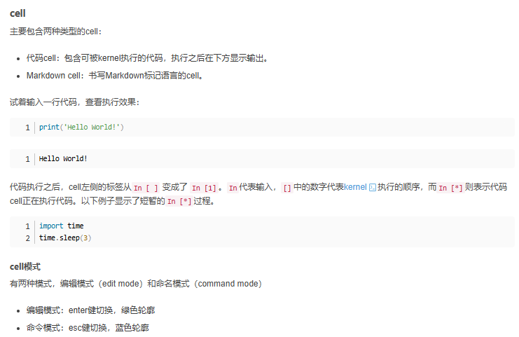
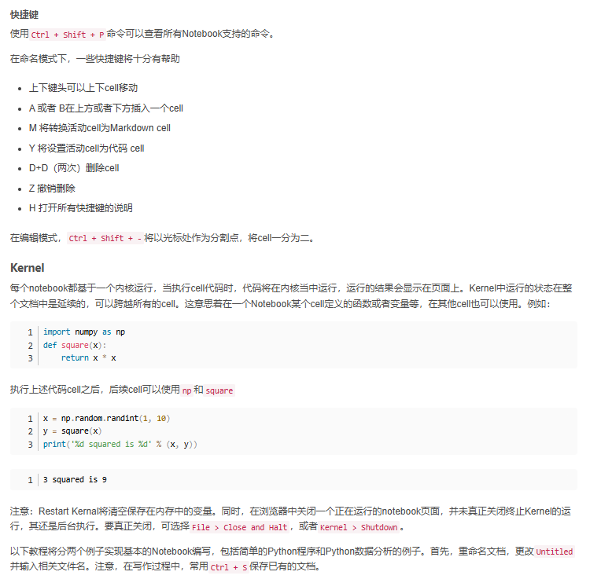
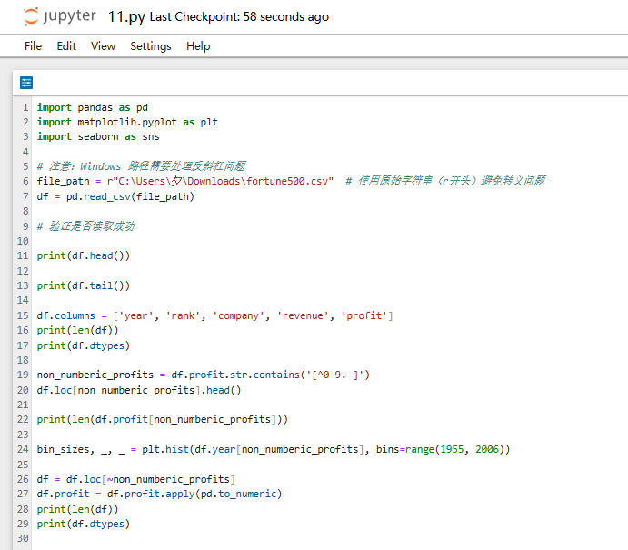
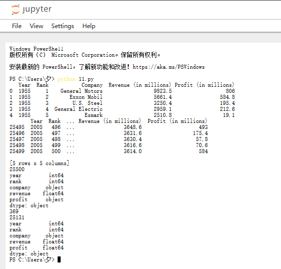
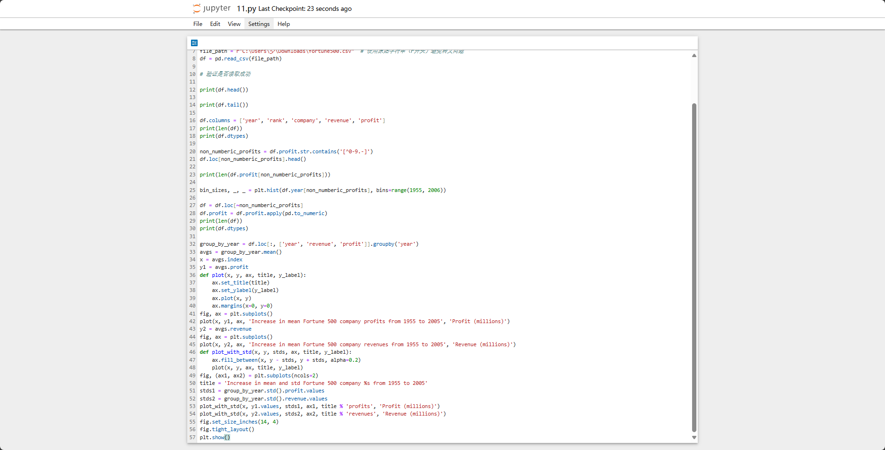
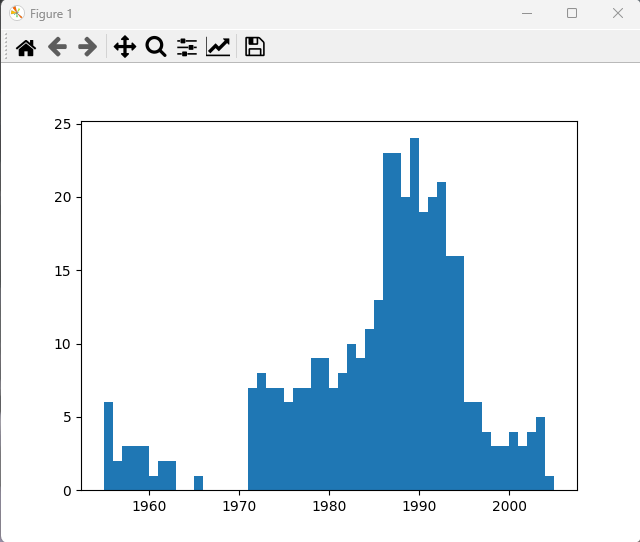
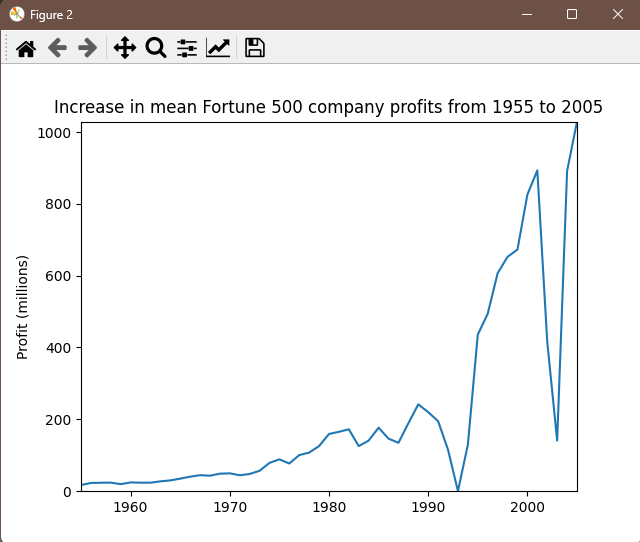
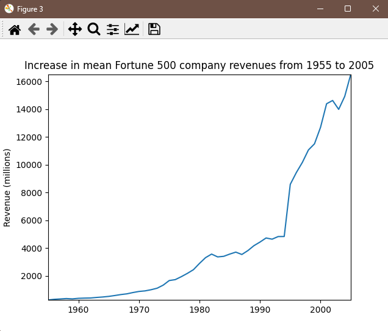
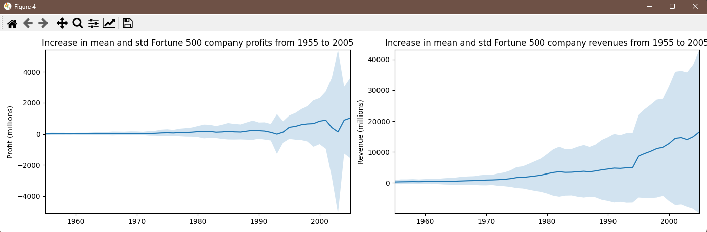

# Jupyter Notebook实践

### Notebook基本概念






### 熟悉基本的Python语法

```python
def selection_sort(arr):
    """
    对列表进行选择排序（升序）
    :param arr: 待排序的列表
    :return: 排序后的列表
    """
    n = len(arr)
    for i in range(n - 1):
        # 找到未排序部分的最小值索引
        min_index = i
        for j in range(i + 1, n):
            if arr[j] < arr[min_index]:
                min_index = j
        # 将最小值交换到已排序部分的末尾
        arr[i], arr[min_index] = arr[min_index], arr[i]
    return arr

def test():
    """
    测试函数：处理输入、调用排序并输出结果
    """
    # 输入数据（例如输入：3 1 4 2）
    input_str = input("请输入待排序的数字，用空格分隔: ")
    arr = list(map(int, input_str.split()))
    # 调用排序函数
    sorted_arr = selection_sort(arr.copy())  # 避免修改原列表
    # 输出结果
    print("原始数组:", arr)
    print("排序结果:", sorted_arr)

if __name__ == "__main__":
    test()
```

请输入待排序的数字，用空格分隔: 5 3 6 2 10
原始数组: [5, 3, 6, 2, 10]
排序结果: [2, 3, 5, 6, 10]

### 数据分析





### 数据图形绘制









